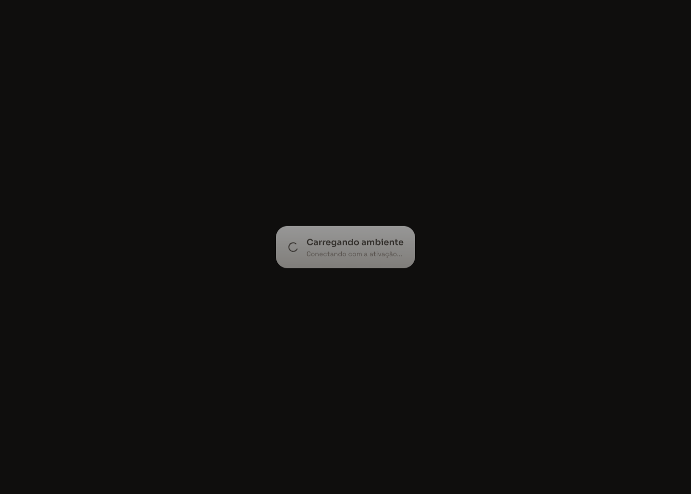
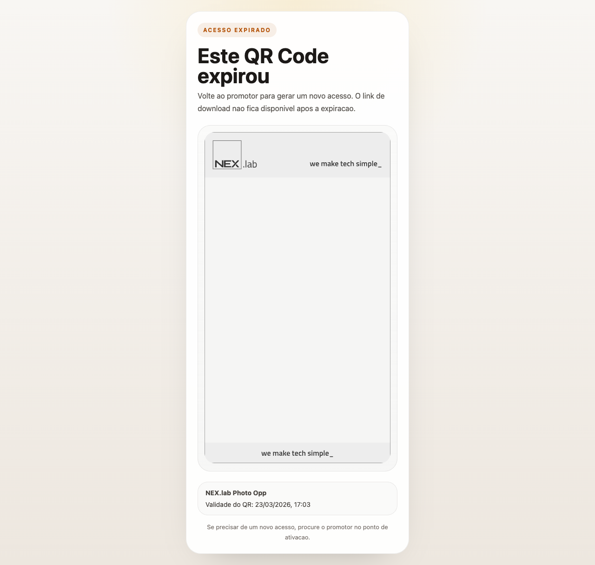

# Photo Opp

Aplicação full stack desenvolvida, com fluxo do promotor, processamento da foto com moldura oficial, entrega por QR Code e painel administrativo.

## O que foi entregue

- autenticação com perfis `admin` e `promoter`
- fluxo do promotor com câmera, captura, revisão e geração de QR Code
- imagem final processada no backend em `1080x1920`, usando moldura oficial
- download por QR Code com validade configurável
- painel admin com métricas, filtros, paginação e visualização do QR da foto
- logs com sanitização de payload e exportação CSV

## Diferenciais relevantes

- validação real da imagem enviada por conteúdo, tamanho e MIME
- página pública com tratamento claro para QR expirado
- configuração centralizada de tema, textos, moldura e TTL por evento
- testes E2E com Playwright cobrindo promotor, admin e QR expirado

## Preview

### Fluxo do promotor




### Painel administrativo


### QR expirado



## Stack

- frontend: `React`, `Vite`, `Tailwind CSS`, `Radix UI`
- backend: `Node.js`, `Fastify`, `Prisma`, `PostgreSQL`, `Sharp`
- testes E2E: `Playwright`
- ambiente local: `Docker` e `Docker Compose`

## Como rodar localmente

```bash
cp .env.example .env
docker compose up -d --build
```

Endpoints:

- frontend: [http://localhost:5173](http://localhost:5173)
- backend: [http://localhost:3333](http://localhost:3333)
- healthcheck: [http://localhost:3333/health](http://localhost:3333/health)

## Credenciais de acesso

- admin: `admin@nexlab.com` / `123456`
- promoter: `promoter@nexlab.com` / `123456`

## Testes

```bash
cd api && npm run lint && npm test
cd ../web && npm run lint && npm run build && npm run test:e2e
```

## Deploy

O repositório inclui um blueprint inicial para Render em [render.yaml](./render.yaml), cobrindo:

- PostgreSQL
- API Node
- frontend estático

## Observação

O projeto usa storage local para simplificar a prova técnica. Para produção, o caminho natural é trocar esse storage por S3 ou equivalente.
